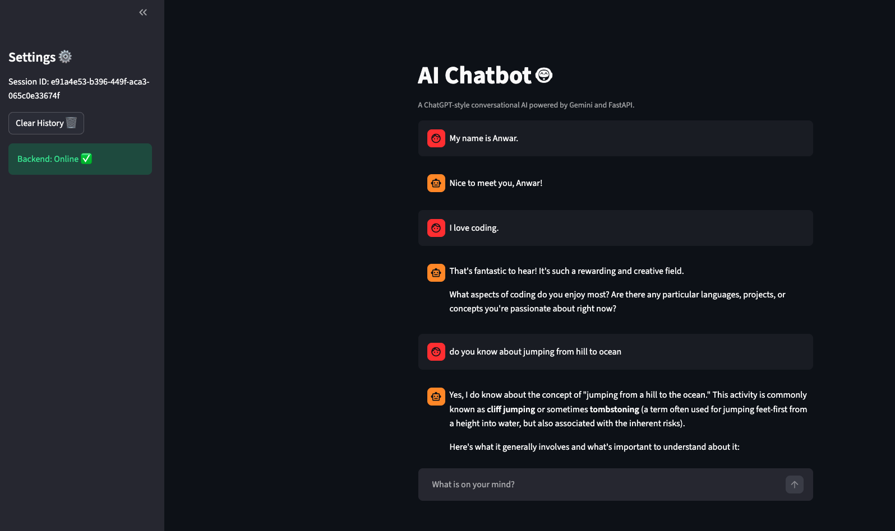

# AI Chatbot with Persistent Memory 🤖

A professional, ChatGPT-style conversational AI chatbot built with **FastAPI**, **PostgreSQL**, and **Google Gemini**. This application features multi-turn conversations, isolated session management, and a modern **Streamlit** frontend.



## 🚀 Features

- **Multi-turn Conversation**: Remembers full chat history within a session.
- **Persistent Memory**: Powered by PostgreSQL to ensure history is saved even after restarts.
- **Session Management**: Independent chat sessions with isolated memories.
- **Rate Limiting**: Security layer preventing API abuse (5 requests/minute).
- **Context Truncation**: Automatically manages history length for optimal AI performance.
- **Automated Testing**: Robust test suite using Pytest and Mocks.
- **Containerized**: Ready to deploy with Docker and Docker Compose.

---

## 🛠️ Tech Stack

- **Backend**: FastAPI (Python 3.10+)
- **Frontend**: Streamlit
- **AI Model**: Google Gemini 1.5 Flash
- **Database**: PostgreSQL
- **DevOps**: Docker & Docker Compose
- **Testing**: Pytest

---

## ⚙️ Prerequisites

Before running the project, ensure you have:

1.  **A Gemini API Key**: Get it from [Google AI Studio](https://aistudio.google.com/).
2.  **Docker Desktop** (Recommended for easiest setup).
3.  **Python 3.10+** (If running without Docker).

---

## 🐳 Option 1: Running with Docker (Recommended)

This is the fastest way to get the entire stack (API, DB, and Frontend) running.

1.  **Clone the Repository**:
    ```bash
    git clone https://github.com/ranak8811/Be-an-AI-Developer.git
    cd Be-an-AI-Developer
    ```
2.  **Setup Environment Variables**:
    Create a `.env` file in the root directory and add your credentials:
    ```env
    DB_USER=postgres
    DB_PASSWORD=postgres
    DB_HOST=db
    DB_PORT=5432
    DB_NAME=ai_developer
    GEMINI_API_KEY=your_gemini_api_key_here
    ```
3.  **Start the Application**:
    ```bash
    docker-compose up --build
    ```
4.  **Access the App**:
    - **Frontend (UI)**: [http://localhost:8501](http://localhost:8501)
    - **API Docs (Swagger)**: [http://localhost:8000/docs](http://localhost:8000/docs)

---

## 💻 Option 2: Local Installation (Windows, Mac, Linux)

### **Step 1: Install & Start PostgreSQL**

- **Mac (Homebrew)**: `brew install postgresql@14 && brew services start postgresql@14`
- **Linux (Ubuntu)**: `sudo apt install postgresql && sudo service postgresql start`
- **Windows**: Download and install from [postgresql.org](https://www.postgresql.org/download/windows/).
- **Create Database**: Open your terminal and run `createdb ai_developer`.

### **Step 2: Setup Python Environment**

```bash
# Create Virtual Environment
python -m venv ai_env

# Activate (Mac/Linux)
source ai_env/bin/activate
# Activate (Windows)
ai_env\Scripts\activate

# Install Dependencies
pip install -r requirements.txt
```

### **Step 3: Run the Application**

1.  **Start Backend**:
    ```bash
    uvicorn app.main:app --reload
    ```
2.  **Start Frontend** (In a new terminal):
    ```bash
    streamlit run frontend/main.py
    ```

---

## 🧪 Testing

We use **Pytest** for automated testing.

```bash
# Ensure your virtual environment is active
export PYTHONPATH=$PYTHONPATH:.
pytest
```

---

## 📂 Project Structure

```text
├── app/
│   ├── routes/      # API Endpoints (Chat, History, Health)
│   ├── services/    # Business Logic (AI Integration, DB Memory)
│   ├── models/      # Pydantic & SQLAlchemy Models
│   ├── config.py    # Environment Configuration
│   └── main.py      # Application Entry Point
├── frontend/        # Streamlit Chat Interface
├── tests/           # Automated Pytest Suite
├── explanation/     # Detailed guides for each build step
├── Dockerfile       # Backend Docker setup
├── docker-compose.yml # Full stack orchestration
└── README.md
```

---

## 👨‍💻 Author

**Anwar Hossain**  
_AI Developer Candidate Task_

---

## 📜 License

This project is strictly confidential and intended for assessment purposes only.
